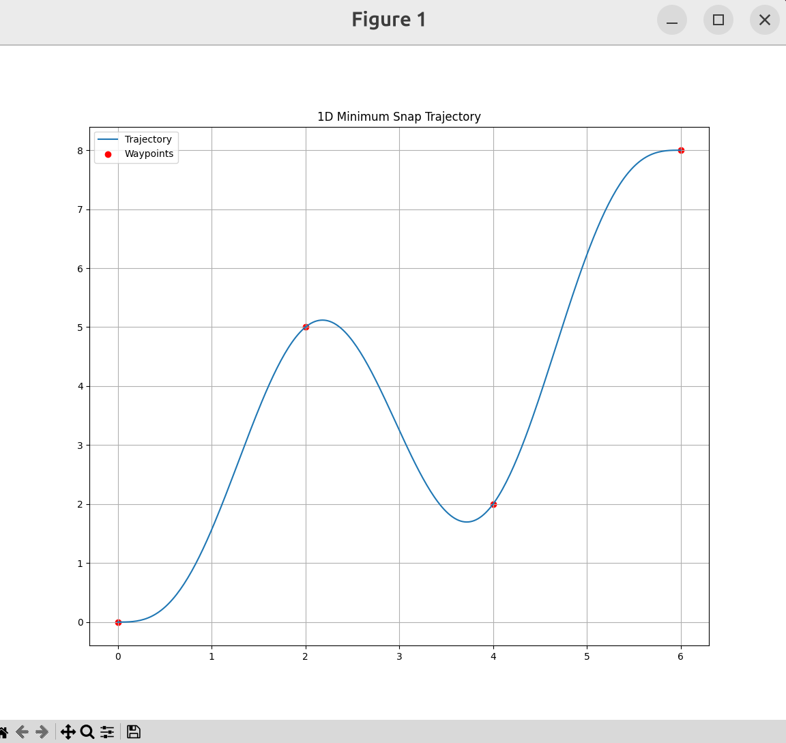
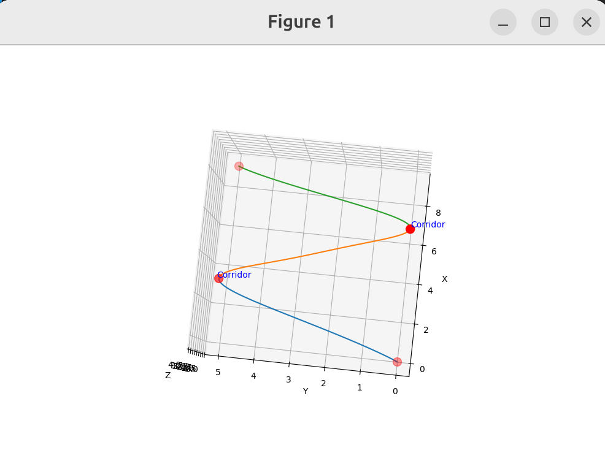

# 一个手搓尝试

推荐阅读：

快速建立对minimum_snap的概念可以读这个[终极速通省流版](https://blog.csdn.net/weixin_65874645/article/details/155024581)。

完整学习用的这个[代码](https://github.com/zm0612/Minimum-Snap/tree/2666bbaeb7442b0a3300d93b4ebd487cd8ba26db)和它的[讲解](https://blog.csdn.net/u011341856/article/details/121861930)。或[这个仓库](https://github.com/symao/minimum_snap_trajectory_generation?tab=readme-ov-file)。


## 0.准备
安一个miniconda
```bash
conda create -n snap_env python=3.10

# 进入环境
conda activate snap_env

# 若要退出
conda deactivate
```

在snap_env的环境下：
```bash
pip install numpy sympy matplotlib osqp
```

## 1. 平面一维轨迹生成
新建一个python文件，把代码复制进去跑就行了(代码放在`scripts/minimum_snap_lab.py`)。

在snap_env环境下运行代码：
```bash
python $文件绝对路径
```
### 代码解释

构造单段轨迹的代价矩阵：
```py
def get_symbolic_q(n,r):

    #n: 多项式阶数 (7阶) r: 优化目标 (4阶导Snap最小)

    # 定义符号变量(t, T)和系数c0, c1, ..., cn
    t, T = sp.symbols('t T')
    c = sp.symbols(f'c0:{n+1}')

    # 定义多项式轨迹
    p = sum(c[i] * (t**i) for i in range(n+1))

    # 计算r阶导数
    p_der = sp.diff(p,t,r)
    
    #最小化能量泛函（这段代码表示以t为积分变量，0为积分下限，T为积分上限，对p_der的平方积分）
    energy = sp.integrate(p_der**2,(t,0,T))

    # 提取二次项系数矩阵Q
    Q_sym = sp.hessian(energy,c)

    # 将符号矩阵转化为可用的 NumPy 函数，方便后续填入具体的 T 值
    q_func = sp.lambdify(T,Q_sym, 'numpy')

    return Q_sym, q_func
```
将代价矩阵对角线拼合：
```py
def get_global_Q(T_list,q_func):

    #假设有m段轨迹，每段飞行时间存放在T_list里
    # q_func则是上面构建的求q矩阵的函数
    
    Q_list = [q_func(t) for t in T_list]
    
    #使用block_diag对角拼接
    Q_all = block_diag(*Q_list)

    return Q_all
```

```py
# 创建多项式在时间 t 处的r阶导数的基向量
def get_poly_basis(t,n,r):
    basis = np.zeros(n + 1)
    for i in range(r, n+1):
        #计算 i*(i-1)*...*(i-r+1)
        val = np.prod([i - j for j in range(r)])
        basis[i] = val * (t**(i - r))
    return basis
```

约束矩阵中的位置约束(注意每段轨迹的始末位置都要放一次，所以中间的位置点都是重复出现两次的，一次作为首，一次作为尾)：
```py
    for i in range(M):
        #轨迹起点
            #创建一个元素权全为0，长度为num_params的数组
        row_start = np.zeros(num_params) 
        row_start[i*(n+1) : (i+1)*(n+1)] = get_poly_basis(0,n,0)
        A_eq.append(row_start)
        b_eq.append(waypoints[i])

        #轨迹终点
        row_end = np.zeros(num_params)
        row_end[i*(n+1) : (i+1)*(n+1)] = get_poly_basis(T_list[i], n, 0)
        A_eq.append(row_end)
        b_eq.append(waypoints[i+1])
```
连续性约束，注意这里使用局部时间参数，每段轨迹时间从0开始计算，而T_list中存放的是每段时长：
```py
    for i in range(M - 1):
        for r in range(1, 4):
            row = np.zeros(num_params)
            # 第 i 段的终点导数
            row[i*(n+1) : (i+1)*(n+1)] = get_poly_basis(T_list[i], n, r)
            # 减去第 i+1 段的起点导数
            row[(i+1)*(n+1) : (i+2)*(n+1)] = -get_poly_basis(0, n, r)
            A_eq.append(row)
            b_eq.append(0)
```
后面就是求解器、时间分配和可视化绘图。

### 优化
#### 时间分配优化
如果使用均分的时间分配方案，每段时间相等，生成轨迹：


使用梯形时间分配：
```py


```
生成轨迹：


#### 闭式求解

会更快，但对于不等式约束就不行了


## 2. 三维轨迹生成和飞行走廊约束

代码参考`scripts/minimum_snap_lab_3d.py`
未加飞行走廊约束：

加了（全段轨迹都加）：

加了中间一段（这个叫ai写的，随便跑了一下，代码没有存在这里）：

这个东西算得太慢了，上不了仿真的
打算去抄抄他山之石（
