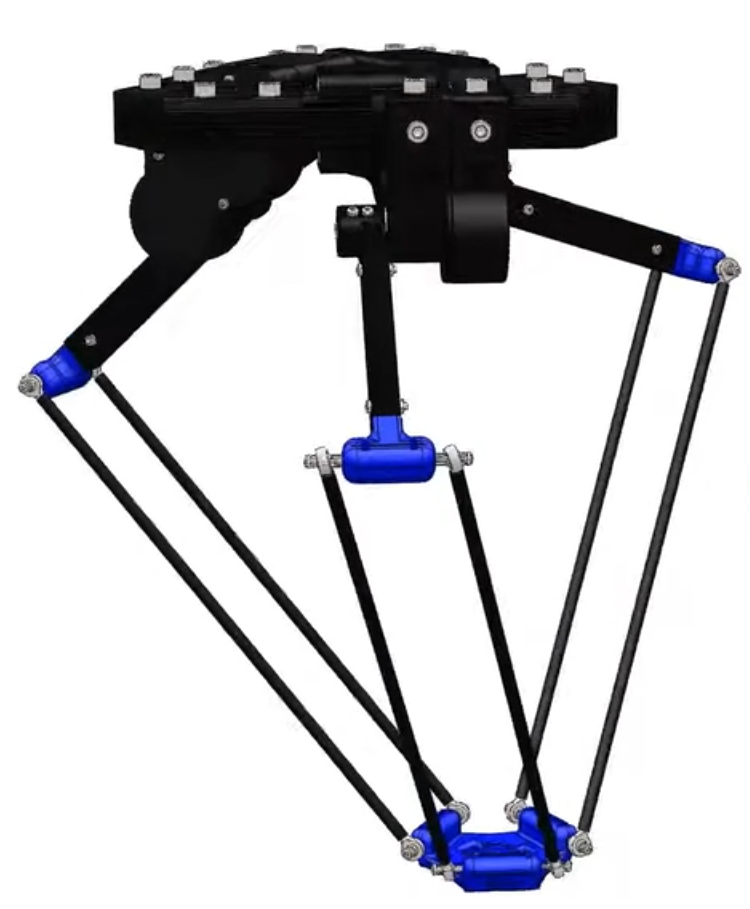

# 空中书写
这是读论文时随便记的，内容不完整，主要是一些自己不明白的点。
## 第一篇论文
原文：
*Aerial Manipulation Using Hybrid Force and
Position NMPC Applied to Aerial Writing*

### 1.建模
#### 动力学方程
将飞机和机械臂整体视为单一刚体，并忽略机械臂移动带来的额外的力（如惯性力等）。

>本文采用经典牛顿-欧拉方程对飞行器-机械臂组合系统的动力学进行建模，将飞行器视为单个刚体，仅考虑机械臂动力学及其与环境交互产生的准静力学力。组合系统的整体动力学方程如下：
$$^W\dot{\boldsymbol{r}}_B = {^W}\boldsymbol{v}_B \tag{1a}$$
$$\dot{\boldsymbol{q}}_{WB} = \frac{1}{2}\Omega(^B\boldsymbol{\omega})\boldsymbol{q}_{WB} \tag{1b}$$
$$^W\dot{\boldsymbol{v}}_B = \frac{1}{m_c}{^C_{WB}}(\boldsymbol{F}_r^B + \boldsymbol{F}_e^B) + {^W}\boldsymbol{g} \tag{1c}$$
$$^B\dot{\boldsymbol{\omega}} = \boldsymbol{J}_c^{-1}\bigl( \boldsymbol{M}_r^B + \boldsymbol{M}_e^B - {^B}\boldsymbol{\omega} \times \boldsymbol{J}_c \cdot {^B}\boldsymbol{\omega} \bigr) \tag{1d}$$
$$\Omega(^B\boldsymbol{\omega}) = \begin{bmatrix} {^B}\boldsymbol{\omega}^\times & -^B\boldsymbol{\omega} \\ {^B}\boldsymbol{\omega}^\top & 0 \end{bmatrix} \tag{1e}$$

**对式（1b）的额外补充：**
用四元数表示位姿。四元数是表示旋转的一种方式，能够避免欧拉角的万向节死锁问题，并且只有四个数 $q = \begin{bmatrix} q_w, & q_x, & q_y, & q_z \end{bmatrix}^\top$ ，计算方便。
想象一个旋转：绕着空间中某一个轴 $u$（单位向量），旋转了 $θ$ 角度。则定义：

$$q_w = \cos\left(\frac{\theta}{2}\right)$$

$$\begin{bmatrix} q_x, & q_y, & q_z \end{bmatrix}^\top = \boldsymbol{u} \cdot \sin\left(\frac{\theta}{2}\right)$$

定义四元数乘法：

>两个四元数 $q_a = [s_a, \boldsymbol{v}_a]$ 和 $q_b = [s_b, \boldsymbol{v}_b]$（其中 $s$ 是实部标量，$\boldsymbol{v}$ 是虚部向量）
$$q_a \otimes q_b = \left[ s_a s_b - \boldsymbol{v}_a \cdot \boldsymbol{v}_b,\ s_a \boldsymbol{v}_b + s_b \boldsymbol{v}_a + \boldsymbol{v}_a \times \boldsymbol{v}_b \right]$$
不满足交换律：$\boldsymbol{q}_a \otimes \boldsymbol{q}_b \neq \boldsymbol{q}_b \otimes \boldsymbol{q}_a$。
满足结合律：$(\boldsymbol{q}_1 \otimes \boldsymbol{q}_2) \otimes \boldsymbol{q}_3 = \boldsymbol{q}_1 \otimes (\boldsymbol{q}_2 \otimes \boldsymbol{q}_3)$。

四元数乘法可以简单理解为**对旋转的加法**。

四元数对时间求导：

假设在极短的时间 $\Delta t$ 内，无人机转动了一个微小的角度 $\Delta\theta=\|\boldsymbol{\omega}\|\Delta t$，旋转轴就是角速度的方向 $\boldsymbol{n}=\frac{\boldsymbol{\omega}}{\|\boldsymbol{\omega}\|}$。
那么这个微小的旋转四元数 $\Delta\boldsymbol{q}$ 可以近似为：
$$\Delta\boldsymbol{q} \approx [1, \frac{1}{2}\boldsymbol{\omega}\Delta t]^\top$$

（利用了 $\cos(\epsilon)\approx1$ 和 $\sin(\epsilon)\approx\epsilon$ 的小角度近似）

旋转后新的姿态 $\boldsymbol{q}(t+\Delta t)$ 等于旧的姿态 $\boldsymbol{q}(t)$ 叠加这个微小旋转：
$$\boldsymbol{q}(t+\Delta t) = \boldsymbol{q}(t) \otimes \Delta\boldsymbol{q}$$

根据导数定义 $\dot{\boldsymbol{q}} = \lim_{\Delta t \to 0}\frac{\boldsymbol{q}(t+\Delta t)-\boldsymbol{q}(t)}{\Delta t}$，经过四元数乘法的代数展开，最终会得到一个惊人简单的结果：
$$\dot{\boldsymbol{q}} = \frac{1}{2}\boldsymbol{q} \otimes [0, \boldsymbol{\omega}]^\top$$

回到公式 (1b) $\dot{\boldsymbol{q}} = \frac{1}{2}\Omega(\boldsymbol{\omega})\boldsymbol{q}$。

计算机算 矩阵 × 向量 是最快的。为了把“四元数乘法”变成“矩阵乘法”，我们把四元数乘法的规则“摊开”写成了矩阵形式。即把 $\boldsymbol{\omega}$ 变成一个4 x 4 矩阵：
$$\Omega(^B\boldsymbol{\omega}) = \begin{bmatrix} [^B\boldsymbol{\omega}]_\times & -^B\boldsymbol{\omega} \\ ^B\boldsymbol{\omega}^\top & 0 \end{bmatrix}$$

#### 转动惯量（惯性张量）
>组合系统的转动惯量可通过下式计算：
$$\boldsymbol{J}_c = \boldsymbol{J} + m_e \cdot \text{diag}(^B\boldsymbol{r}_E - ^B\boldsymbol{r}_{E0})^2$$
其中，$\boldsymbol{J} = \text{diag}(J_x, J_y, J_z)$ 为飞行器（含标称位置的机械臂）的惯性张量，$\text{diag}(\cdot)$ 为对角矩阵。

在初中或高中物理中，我们习惯把转动惯量（Moment of Inertia）看作一个简单的数字（标量）。
但在 3D 空间和机器人学中，物体可以绕一个点向任意方向转动，这时候一个数字就不够用了，必须升级为矩阵（严格来说叫惯性张量，Inertia Tensor）。
$$
 \boldsymbol{J} =
\begin{bmatrix}
J_{xx} & -J_{xy} & -J_{xz} \\
-J_{xy} & J_{yy} & -J_{yz} \\
-J_{xz} & -J_{yz} & J_{zz}
\end{bmatrix}
$$
- 主对角线元素 $J_{xx}, J_{yy}, J_{zz}$：绕 $x,y,z$ 轴的转动惯量。
- 非对角线元素 $-J_{xy}, -J_{xz}, -J_{yz}$：对应惯性积 $J_{xy}, J_{xz}, J_{yz}$ 的负值，体现质量分布的非对称性。

如果选择的坐标系合适，可使惯量积的值为零。
这样的坐标系轴称为**主轴**，相应的惯量称为**主惯量（principal moments of inertia）**。事实上，主惯量是惯量矩阵的三个特征值。
这个结论是由对称矩阵的数学性质决定的。（这里用I来表示惯性张量了，懒得改了）
$$
I_{xy} = I_{yz} = I_{xz} = 0
$$

$$
\boldsymbol{I} =
\begin{bmatrix}
I_{xx} & 0 & 0 \\
0 & I_{yy} & 0 \\
0 & 0 & I_{zz}
\end{bmatrix}
$$

在转动中，角动量 $\boldsymbol{L}$ 和角速度 $\boldsymbol{\omega}$ 的关系是：

$$
\boldsymbol{L} = \boldsymbol{J} \cdot \boldsymbol{\omega}
$$

在这里作者假设机械臂在标称位置下，无人机是对称的，则非对角元素均取0， $J$ 是对角矩阵。

而后面补的那一项 $m_e \cdot \text{diag}(^B\boldsymbol{r}_E - ^B\boldsymbol{r}_{E0})^2$ 则是由平行轴定理简化计算得到的，末端执行器在偏离了标称位置之后附加的转动惯量。

### 2.控制

>最优输入序列 $\boldsymbol{u}^\ast$ 通过在线求解以下带约束的优化问题得到：
$$
\boldsymbol{u}^\ast = \underset{\boldsymbol{u}_0, \dots, \boldsymbol{u}_{N_f}}{\text{argmin}} \left\{ \Phi\left(\boldsymbol{x}_{N_f}, \boldsymbol{x}_{N_f}^r\right) + \sum_{n=0}^{N_f-1} L\left(\boldsymbol{x}_n, \boldsymbol{x}_n^r, \boldsymbol{u}_n\right) \right\} \tag{7a}
$$
$$s.t.：$$
$$
\boldsymbol{x}_{n+1} = f_d\left(\boldsymbol{x}_n, \boldsymbol{u}_n\right) \tag{7b}
$$
$$
\boldsymbol{x}_0 = \hat{\boldsymbol{x}} \tag{7c}
$$
$$
u_{lb} \leq u_i \leq u_{ub},\ i=1,\dots,7 \tag{7d}
$$

先补课：
[【【Advanced控制理论】7_线性控制器设计_Linear Controller Design】](https://www.bilibili.com/video/BV1sW411t7Qq/?share_source=copy_web&vd_source=6a65513384955cc33f848d6a6894e1a1)

$\underset{\boldsymbol{u}_0, \dots, \boldsymbol{u}_{N_f}}{\text{argmin}}$ 
- $\arg\min f(x)$指的是为了得到这个最小值，变量 $x$ 应该等于多少（关注原因）。
- 决策变量 $u_0, \dots, u_{N_f}$。算法不是只算当前一刻的指令，而是同时计算未来 $N_f$ 个步长的指令序列。

$\sum_{n=0}^{N_f-1} L\left(\boldsymbol{x}_n, \boldsymbol{x}_n^r, \boldsymbol{u}_n\right)$
- 过程代价
- 在控制理论中，$\dot{\boldsymbol{x}} = \boldsymbol{A}\boldsymbol{x} + \boldsymbol{B}\boldsymbol{u}$ 是线性系统状态空间表达式的核心。他的离散形式就是：$\boldsymbol{x}_{n+1} = f_d\left(\boldsymbol{x}_n, \boldsymbol{u}_n\right)$。
- 一个$L$包含：误差代价（快速收敛）、控制代价（光滑，省力）。两者平方加权取最小，就是最优控制结果。

$\Phi\left(\boldsymbol{x}_{N_f}, \boldsymbol{x}_{N_f}^r\right)$
- 终端代价，强制要求系统在预测窗口的结尾必须处于一个接近平衡、可控的状态。

### 3.机械臂控制
delta并联机械臂由三个主动臂、三个从动臂组成。

主动臂120度夹角对称分布，与顶盘用电机连接，可在垂直平面内转动，运动轨迹为垂直于顶盘的圆盘。
从动臂120度夹角对称分布，两端分别与主动臂、从动臂用万向关节连接，均无动力。此外，从动臂并不是单独一根杆子，而是由两根完全等长的平行连杆组成的，两根连杆一头连接在主动臂末端的“小横梁”上，另一头连接在底盘边缘的“小横梁”上。根据平行四边形的几何性质，这个结构保证了底盘始终是水平的。

这一块就是机械臂运动学解算。
正运动学：已知各关节角，求末端执行器位姿
逆运动学：已知末端执行器位姿，反推各关节角
看[delta并联机械臂原理](https://www.bilibili.com/video/BV1n541127im/?share_source=copy_web&vd_source=6a65513384955cc33f848d6a6894e1a1)（从这个视频中后段开始看，看完运动学部分）。

**正运动学:**
即根据关节角度 $\theta_1$、$\theta_2$、$\theta_3$ 求解末端执行器在机械臂坐标系 $A$ 中的位置 $^A\boldsymbol{r}_E$，求解方法为**计算三个半径为 $l$ 的球面的交点**（通过 $R-r$ 将底盘半径 $r$ ”消除“掉，执行器中心位置就是三个球面交点，不用考虑底盘半径），三个球面的球心坐标为：
$$
\begin{aligned}
^A\boldsymbol{r}_{J1} &= (R - r + L\cos\theta_1)\,^A\boldsymbol{e}_x - L\sin\theta_1 \cdot\,^A\boldsymbol{e}_z \\
^A\boldsymbol{r}_{J2} &= C_z(120^\circ)\left((R - r + L\cos\theta_2)\,^A\boldsymbol{e}_x - L\sin\theta_2 \cdot\,^A\boldsymbol{e}_z\right) \\
^A\boldsymbol{r}_{J3} &= C_z(240^\circ)\left((R - r + L\cos\theta_3)\,^A\boldsymbol{e}_x - L\sin\theta_3 \cdot\,^A\boldsymbol{e}_z\right)
\end{aligned}
$$

**逆运动学：**
为每个关节角度计算**半径为 $l$ 的球面与半径为 $L$ 的圆盘的交点**。以第一个关节为例，球面的球心为 $^A\boldsymbol{r}_{P1} = {^A}\boldsymbol{r}_E + r \cdot {^A}\boldsymbol{e}_x$（$^A\boldsymbol{e}_x = [1,0,0]^\top$），圆盘的圆心为 $^A\boldsymbol{r}_{S1} = R \cdot {^A}\boldsymbol{e}_x$。求得交点 $^A\boldsymbol{r}_{I1}$ 后，可通过下式恢复关节角度：
$$
\theta_1 = \arcsin\left(\frac{^A r_{I1z}}{L}\right)
$$

### 4.机身轨迹生成
书接上上文，无人机书写时，不是让机身固定不动只动机械臂，也不是机械臂与机身的相对位置固定而直接移动机身整体。
书写产生的位移大部分由机械臂承担，剩余由机身的运动承担，两者所占的最佳比例通过 $
\boldsymbol{u}^\ast = \underset{\boldsymbol{u}_0, \dots, \boldsymbol{u}_{N_f}}{\text{argmin}} \left\{ \Phi\left(\boldsymbol{x}_{N_f}, \boldsymbol{x}_{N_f}^r\right) + \sum_{n=0}^{N_f-1} L\left(\boldsymbol{x}_n, \boldsymbol{x}_n^r, \boldsymbol{u}_n\right) \right\} 
$ 计算得出（其中 $L$ 和 $\Phi$ 的代价形式为$
\boldsymbol{e}_i^\top \boldsymbol{Q}_i \boldsymbol{e}_i$, $\forall \boldsymbol{e}_i \in \{ \boldsymbol{e}_{rB}, \boldsymbol{e}_{rE}, \boldsymbol{e}_v, \boldsymbol{e}_\omega, \boldsymbol{e}_q, \boldsymbol{e}_f, \boldsymbol{e}_u \}
$），可以看到机身和机械臂位置误差 $\boldsymbol{e}_{rB}, \boldsymbol{e}_{rE}$ 都出现在代价函数中）。

并且 $
\begin{aligned}
\boldsymbol{e}_{rB} &= {}^W\boldsymbol{r}_B - {}^W\boldsymbol{r}_B^r \\
\boldsymbol{e}_{rE} &= {}^W\boldsymbol{r}_E - {}^W\boldsymbol{r}_E^r 
\end{aligned}
$ 。这里的 ${}^W\boldsymbol{r}_E^r$ 可由设计的书法笔画得到，那么 ${}^W\boldsymbol{r}_B^r$ 呢？

$$
{}^W\boldsymbol{r}_B^r = {}^W\boldsymbol{r}_E^r - \boldsymbol{C}_{WB} \cdot {}^B\boldsymbol{r}_{E0}
$$

其中 ${}^B\boldsymbol{r}_{E0}$ 是机械臂处于最自然状态的标称位置。按照这个固定的相对位置去计算机身的位姿，并满足笔尖垂直接触面。

## 第二篇论文
*Flying Calligrapher: Contact-Aware Motion and Force Planning and
Control for Aerial Manipulation*

### 1.建模
$$
\boldsymbol{M}\dot{\boldsymbol{v}} + \boldsymbol{C}\boldsymbol{v} + \text{Ad}_{T_\varepsilon^B} \boldsymbol{g} = \text{Ad}_{T_\varepsilon^B} \boldsymbol{\tau}_a + \text{Ad}_{T_\varepsilon^c} \boldsymbol{\tau}_c \tag{1}
$$

其中，$\boldsymbol{M} \in \mathbb{R}^{6×6}$ 为惯性矩阵，$\boldsymbol{C} \in \mathbb{R}^{6×6}$ 为离心力和科氏力项，$\boldsymbol{g} \in \mathbb{R}^6$ 为重力空间力，$\boldsymbol{\tau}_c \in \mathbb{R}^6$ 为接触空间力，$\boldsymbol{\tau}_a = [\boldsymbol{f}_a^\top, \boldsymbol{m}_a^\top]^\top \in \mathbb{R}^6$ 为无人机操作器执行机构输出的控制空间力，$\boldsymbol{f}_a \in \mathbb{R}^3$ 为控制力，$\boldsymbol{m}_a \in \mathbb{R}^3$ 为控制扭矩。

惯性矩阵/广义质量矩阵：
惯性张量处理的是转动惯量，惯性矩阵则是平动质量和转动惯量打包在一起的结果。

### 2.控制
2020论文没有显式考虑摩擦力（可能是将其视为微小量），只考虑了接触面法向力（弹簧线性模型）。而本文将包括摩擦力在内的接触力视为可预测项。

……这里没什么好说的。

>控制空间力 $\boldsymbol{\tau}_a$ 由运动跟踪控制器输出 $\boldsymbol{\tau}_p$ 和空间力跟踪控制器输出 $\boldsymbol{\tau}_f$ 融合得到，公式为：
$$
^B\boldsymbol{\tau}_a = \boldsymbol{R}_{BC}\left((\boldsymbol{I}_{6×6} - \boldsymbol{\Lambda})\boldsymbol{R}_{CB} \cdot {}^B\boldsymbol{\tau}_p + \boldsymbol{\Lambda}\boldsymbol{R}_{CB} \cdot {}^B\boldsymbol{\tau}_f\right) \tag{11}
$$
其中，$\boldsymbol{\Lambda} = \text{blockdiag}[\delta,0,0,0,0,0] \in \mathbb{R}^{6×6}$，$\delta \in \{0,1\}$。矩阵 $\boldsymbol{\Lambda}$ 用于选择直接力控制指令，其补空间则用于运动控制；$\delta$ 为基于参考法向力 $r_F$ 的力-运动控制切换因子，当 $r_F=0$ 时，$\delta=0$，对应纯运动控制；当 $r_F>0$ 时，$\delta=1$，表示沿表面法向进行力控制。

选择矩阵的作用：发生接触时，启动力的控制器，无接触时，使用普通控制器。

>运动控制方面，设计比例-积分-微分（PID）控制器直接控制末端执行器的运动，公式为：
$$
\boldsymbol{\tau}_p = r\boldsymbol{\tau}_a + r\boldsymbol{\tau}_c - \hat{\boldsymbol{\tau}}_c - \boldsymbol{K}_q \boldsymbol{e}_q - \boldsymbol{K}_v \boldsymbol{e}_v - \boldsymbol{K}_i \int \boldsymbol{e}_q dt
$$

第一项 $r\boldsymbol{\tau}_a$：前馈

第二、三项 $r\boldsymbol{\tau}_c - \hat{\boldsymbol{\tau}}_c$：由于这次我们把力也放到控制项里了，在位姿变化前，可以先测量一下接触力并提前予以补偿

第四项 $ - \boldsymbol{K}_q \boldsymbol{e}_q$：比例项

第五项 $- \boldsymbol{K}_v \boldsymbol{e}_v$：微分项

第六项 $- \boldsymbol{K}_i \int \boldsymbol{e}_q dt$：积分项

>其中，误差项定义为：
$$
\begin{aligned}
\boldsymbol{e}_q &= \left[\boldsymbol{e}_p^\top, \boldsymbol{e}_R^\top\right]^\top, \quad \boldsymbol{e}_v = \left[\dot{\boldsymbol{e}}_p^\top, \boldsymbol{e}_\omega^\top\right]^\top \\
\boldsymbol{e}_p &= \boldsymbol{p} - \boldsymbol{r}_p, \quad \boldsymbol{e}_R = \frac{1}{2}\left({^r}\boldsymbol{R}_{WB}^\top \boldsymbol{R}_{WB} - \boldsymbol{R}_{WB} \cdot {^r}\boldsymbol{R}_{WB}^\top\right)^\lor \\
\boldsymbol{e}_\omega &= \boldsymbol{\omega} - {^r}\boldsymbol{\omega}
\end{aligned}
$$

注意这里求旋转矩阵误差的方法 $\boldsymbol{e}_R = \frac{1}{2}\left({^r}\boldsymbol{R}_{WB}^\top \boldsymbol{R}_{WB} - \boldsymbol{R}_{WB} \cdot {^r}\boldsymbol{R}_{WB}^\top\right)^\lor$。在minimum snap那篇论文中也出现过。

计算控制空间力的笔记直接写到论文上了……