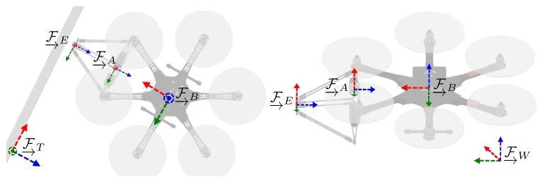
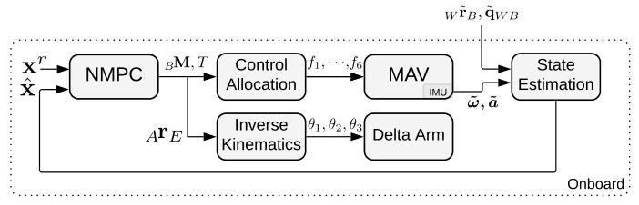
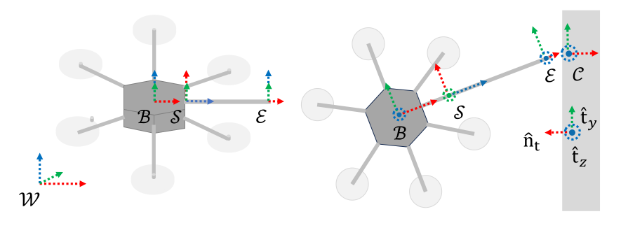

# 空中书法无人机运动规划

**论文一 (2020):** 《Aerial Manipulation Using Hybrid Force and Position NMPC Applied to Aerial Writing》
**论文二 (2024):** 《Flying Calligrapher: Contact-Aware Motion and Force Planning and Control for Aerial Manipulation》

---

# 论文一（2020）
## 基于混合力位非线性模型预测控制的空中操作及其空中书写应用
*Aerial Manipulation Using Hybrid Force and Position NMPC Applied to Aerial Writing*

---

# 01. 硬件设计

**欠驱动**六旋翼飞行器 
Delta并联机械臂

---
# 02.简化建模
## 接触力 线性弹簧近似 简化建模：
本文采用 **非切换式**（Non-switching）的混合模型，将末端执行器与书写表面接触产生的力简化为法向的弹簧模型。

系统将书写表面（白板）视为一个具有给定刚度的线性弹簧：

$${}_E \mathbf{F}_c = \mathbf{C}_{ET} (k_s \cdot {}_T r_{Ez})$$

* $k_s$：弹簧刚度系数。
* ${}_T r_{Ez}$：末端执行器沿接触面法向的虚拟侵入深度。

自由飞行阶段，侵入深度<0，接触力为0；接触书写阶段，笔尖进入虚拟侵入区域，接触力随深度线性增长。
**本文并未显式地将摩擦力纳入预测模型（这与 2024 年论文不同）。**

---
## 无人机-机械臂 准静态简化建模：
 机械臂移动相对缓慢，运动产生的额外力忽略不计。因而本文将“无人机+机械臂”视为一个变重心的单刚体。
论文首先定义末端执行器**标称位置** $_B \mathbf{r}_{E_0}$，在这个位置时，整个系统的重心（CoM）与无人机的几何中心恰好重合。
不考虑机械臂内部结构，将其简化为一个质量为 $m_e$​ 的刚体。当它的等效重心位置偏离**标称位置**时，就会产生一个力矩（其中第一项为接触力矩，第二项为重心偏移带来的力矩）：
$${}_B \mathbf{M}_e = {}_B \mathbf{r}_E \times {}_B \mathbf{F}_e + ({}_B \mathbf{r}_E - {}_B \mathbf{r}_{E0}) \times (\mathbf{C}_{BW} m_e \cdot {}_W \mathbf{g})$$
此外，惯性张量（转动惯量）也需要修正：
$$\mathbf{J}_c = \mathbf{J} + m_e \cdot \text{diag}({}_B \mathbf{r}_E - {}_B \mathbf{r}_{E0})^2$$

---
# 03. 轨迹生成
**末端执行器轨迹 ${}_W\boldsymbol{r}_E^r$ ， ${}_W\boldsymbol{v}_E^r$ ：** 采用恒加速度运动模型，将需要书写的字符转换为末端执行器的平滑运动轨迹。

**机身轨迹 ${}_W\boldsymbol{r}_B^r$ ， ${}_W\boldsymbol{v}_B^r$：** 
$$
{}_W \mathbf{r}_B^r = {}_W \mathbf{r}_E^r - \mathbf{C}_{WB} {}_B \mathbf{r}_{E_0},
$$

$$
{}_W \mathbf{V}_B^r = {}_W \mathbf{V}_E^r - \mathbf{C}_{WB} \left( {}_B \omega^r \times {}_B \mathbf{r}_{E_0} \right).
$$

其中 $_B \mathbf{r}_{E_0}$ 为末端执行器的标称位置，在该位置下，认为质心无偏移。
按照末端执行器始终在标称位置的情况设计机身轨迹。

---
# 04. NMPC控制
## 系统概述

系统基于 非线性模型预测控制 (NMPC)，接收 MAV（机身）和末端执行器（笔尖）的全状态参考轨迹 $X^r$。结合当前系统状态估计值 $\hat{X}$ ，通过优化计算得出期望的机身力矩、总推力以及末端执行器的目标位置。由此计算出各桨转速、机械臂电机角度等。

---
## 最优控制序列
最优控制序列 $\boldsymbol{u}^*$ 通过求解以下带约束优化问题得到：

$$\begin{aligned}
\boldsymbol{u}^* = \arg \min_{\boldsymbol{u}_0, \dots, \boldsymbol{u}_{N_f}} & \left\{ \Phi(\boldsymbol{x}_{N_f}, \boldsymbol{x}_{N_f}^r) + \sum_{n=0}^{N_f-1} L(\boldsymbol{x}_n, \boldsymbol{x}_n^r, \boldsymbol{u}_n) \right\} \\
\text{s.t. } & \boldsymbol{x}_{n+1} = f_d(\boldsymbol{x}_n, \boldsymbol{u}_n) \quad (\text{动力学约束}) \\
& \boldsymbol{x}_0 = \hat{\boldsymbol{x}} \quad (\text{状态反馈}) \\
& \boldsymbol{u}_{lb} \le \boldsymbol{u}_i \le \boldsymbol{u}_{ub} \quad (\text{执行器物理极限})
\end{aligned}$$

>该最优控制问题基于改进版 CT 工具箱 [7] 实现，离散化步长为 10ms，固定预测时域为 2s，采用四阶龙格 - 库塔法进行积分，并对四元数进行重归一化处理。

---
## 多目标统一优化
$L$ 和 $\Phi$ 的代价形式为 $
\boldsymbol{e}_i^\top \boldsymbol{Q}_i \boldsymbol{e}_i$ ，$\forall \boldsymbol{e}_i \in \{ \boldsymbol{e}_{rB}, \boldsymbol{e}_{rE}, \boldsymbol{e}_v, \boldsymbol{e}_\omega, \boldsymbol{e}_q, \boldsymbol{e}_f, \boldsymbol{e}_u \}$
机身和机械臂位置误差 $\boldsymbol{e}_{rB}$，$\boldsymbol{e}_{rE}$ 都出现在代价函数中，书写轨迹不是由机械臂移动独立完成的，实现了飞行平台与操作臂之间的协同控制。

## 带约束的滚动优化

本系统采用 2s 预测时域为控制器提供充足的“前瞻性”，使其能够在实际接触发生前预判接触力的变化并提前调整推力,以 10ms 为离散步长 (100Hz) 高频迭代，将最新的状态估计值 $\hat{x}$ 注入初始状态 $x_0$​ 实时感知并修正偏差。
同时，通过在优化过程中显式引入物理约束 $u_{lb}$​,$u_{ub}$​，系统能够自动规避电机与机械臂超限风险。

---
# 05. 控制分配
## 电机推力指令
对于四旋翼无人机，4个待求解的电机转速对应4个控制目标，解应该是唯一的。对于本文中的六旋翼无人机，控制目标仍然是4个，变量多于约束，解不唯一。
因此，需要对六旋翼转速分配 $\mathbf{f} = [f_1, \dots, f_6]^\top$进行优化：

$$\begin{aligned}
\mathbf{f}^* = \arg \min_{\mathbf{f}} & \left( \left\| \mathbf{A}\mathbf{f} - \mathbf{u}_{0, 1:4}^* \right\|_{\mathbf{W}}^2 + \lambda \|\mathbf{f}\|_2^2 \right) \\
\text{s.t. } & f_{\min} \le f_i \le f_{\max}, \quad i = 1, \dots, 6
\end{aligned}$$

第一项（精确性）：最小化实际产生的力/力矩与 NMPC 理想指令 $\mathbf{u}_{0, 1:4}^*$ 之间的偏差。
第二项：参数 $\lambda = 10^{-7}$ 用于惩罚过大的控制输入，使 6 个电机的出力更加均匀，避免单个电机过载或不转。
约束：显式考虑电机物理特性的推力上下限 $[f_{\min}, f_{\max}]$。

---
## 末端执行器指令
通过求解Delta并联机械臂正逆运动学，由末端执行器位置计算得到三个电机的转动角度。
>delta并联机械臂由三个主动臂、三个从动臂组成。
主动臂120度夹角对称分布，与顶盘用电机连接，可在垂直平面内转动，运动轨迹为垂直于顶盘的圆盘。
从动臂120度夹角对称分布，两端分别与主动臂、从动臂用万向关节连接，均无动力。此外，从动臂并不是单独一根杆子，而是由两根完全等长的平行连杆组成的，两根连杆一头连接在主动臂末端的“小横梁”上，另一头连接在底盘边缘的“小横梁”上。根据平行四边形的几何性质，这个结构保证了底盘始终是水平的。
---

# 论文二（2024）
## 飞行书法家：面向空中操作的接触感知型运动与力规划及控制
*Flying Calligrapher: Contact-Aware Motion and Force Planning and
Control for Aerial Manipulation*

---
# 01. 硬件设计

- **全驱动**六旋翼无人机 
- 与机身**刚性连接**的操作臂 
- 笔画宽度正比于法向力的的笔头

---
# 02. 建模
## 以末端执行器为参考系的动力学建模
不同于传统以质心为中心的建模，本文直接描述末端执行器尖端的运动轨迹与受力平衡，通过随体变换矩阵 $Ad_{T_{\mathcal{E}}^{\mathcal{B}}}$（Adjoint Map），将无人机电机的控制空间力 $\boldsymbol{\tau}_{a}$ 和环境接触力 $\boldsymbol{\tau}_{c}$ 统一映射到末端执行器坐标系下，使得轨迹跟踪与力控制在数学表达上更加直接：

$$M\dot{\mathbf{v}} + C\mathbf{v} + Ad_{T_{\mathcal{E}}^{\mathcal{B}}}\mathbf{g} = Ad_{T_{\mathcal{E}}^{\mathcal{B}}}\boldsymbol{\tau}_{a} + Ad_{T_{\mathcal{E}}^{\mathcal{C}}}\boldsymbol{\tau}_{c}$$

---
## 考虑摩擦力的接触力建模
本文不仅考虑了垂直于墙面的法向力，还利用**库仑摩擦模型**对书写过程中的切向阻力进行了在线预测：

$$\boldsymbol{\tau}_{c} = F \cdot \alpha(\mathbf{v})$$

**法向力 $F$**：直接决定了海绵笔头的形变程度，从而控制**笔画宽度**。

**方向分配向量 $\alpha(\mathbf{v})$**：这是一个随末端运动状态 $\mathbf{v}$ 实时变化的单位映射向量，它决定了力 $F$ 如何在空间中分配。末端与墙面视为点接触，假设不产生反作用扭矩。

$$\alpha(\mathbf{v}) = [ \underbrace{\hat{n}_{t}}_{\text{法向}}, \underbrace{-\mu_y \text{sign}(\dot{y})\hat{t}_y, -\mu_z \text{sign}(\dot{z})\hat{t}_z}_{\text{切向摩擦力}}, \underbrace{0, 0, 0}_{\text{无力矩}} ]^\top$$

---
# 03. 轨迹规划
## 运动与力同步规划
输入航点不再是简单的位置坐标，而是包含目标接触力的增广航点。
$$\mathcal{S} = \{ ({}^r \mathbf{p}_{c1}, {}^r F_1), ({}^r \mathbf{p}_{c2}, {}^r F_2), \dots, ({}^r \mathbf{p}_{cM}, {}^r F_M) \}$$
> * **接触状态判定：**
> * 若 ${}^r F_i > 0$ ：**书写点**（进行力-位混合控制）。
> * 若 ${}^r F_i = 0$ ：**空移点**（仅进行位置控制，用于笔画间的切换抬笔）。

---
## 时间均匀化处理

#### 1. 轨迹优化目标函数

规划器通过最小化以下代价函数，生成动力学可行的状态与控制序列（航点约束、物理约束不一一列举了）：

$$\min_{\mathbf{x}_{1:N}, \boldsymbol{\tau}_{a1:N}} \sum_{n=1}^{N} \underbrace{ \left( \|\mathbf{v}_n\|_{W_v}^2 + \|\boldsymbol{\tau}_{an}\|_{W_{\tau}}^2 + \|\delta\boldsymbol{\tau}_{an}\|_{W_{d\tau}}^2 + \gamma \right) }_{\text{综合运行代价}} \cdot h_n$$

- $\|\mathbf{v}_n\|_{W_v}^2$：**速度惩罚**。本文使用全驱动无人机，无需最小化$jerk$或$snap$。
- $\|\boldsymbol{\tau}_{an}\|_{W_{\tau}}^2$：**能耗惩罚**。
- $\|\delta\boldsymbol{\tau}_{an}\|_{W_{d\tau}}^2$：**平顺性惩罚**。
- $\gamma \cdot h_n$：**时间惩罚**。其中 $\gamma$ 是权重，促使系统在满足约束的前提下尽快完成任务。

---
#### 2. 线性插值 均匀化处理

由于步长 $h_n$ 是优化变量，规划器输出的原始点在时间轴上是**非均匀分布**的。为了让频率固定的底层控制器（100Hz）能够读取，必须进行线性插值，均匀化处理：

$$\mathbf{x}(t) = \lambda \mathbf{x}_j + (1-\lambda) \mathbf{x}_{j+1}, \quad \lambda = \frac{t - T_j}{T_{j+1} - T_j}$$

---
# 04. 混合运动-力控制
## 接触力估计
获取末端执行器上的力传感器的原始数据，结合运动学模型对接触力进行估计：

提取传感器测量的垂直墙面分量。由于书写表面是垂直的，机械臂刚性平行连接于无人机，可以认为无人机在书写过程中保持水平，垂直墙面分量简化计算为：

$$\hat{F} \approx [R_{\mathcal{B}}^{\mathcal{S}} \cdot {}_{\mathcal{S}}\tilde{\boldsymbol{\tau}}_{s[1:3]}]_{[1]}$$

切向力不通过传感器提取，而是利用 **库仑摩擦模型** 通过法向力补全。为了规避测量噪声导致的符号切换（抖动），**采用规划速度 ${}^r\mathbf{v}$** 代替实际速度进行计算：

$${}_{\mathcal{C}} \hat{\boldsymbol{\tau}}_{c} = \hat{F} \cdot \alpha({}^r\mathbf{v})$$

其中，$\alpha({}^r\mathbf{v})$ 为包含摩擦力方向的单位映射向量。

---
## 混合运动-力控制器
### 运动控制 保证字形精准
不同于常规的 PID，它通过接触力补偿解决了空中作业中最大的扰动问题：
$$\boldsymbol{\tau}_p = \underbrace{{}^r \boldsymbol{\tau}_a}_{\text{前馈}} + \underbrace{({}^r \boldsymbol{\tau}_c - \hat{\boldsymbol{\tau}}_c)}_{\text{接触力补偿}} - \underbrace{\boldsymbol{K}_q \boldsymbol{e}_q}_{\text{比例项}} - \underbrace{\boldsymbol{K}_v \boldsymbol{e}_v}_{\text{微分项}} - \underbrace{\boldsymbol{K}_i \int \boldsymbol{e}_q dt}_{\text{积分项}}$$

**接触力补偿：** 当传感器发现实际接触力 $\hat{\boldsymbol{\tau}}_c$ 与规划的期望力 ${}^r \boldsymbol{\tau}_c$ 不一致时（例如阻力变大），在位姿发生偏移之前提前介入补偿。

---
### 力控制 保证笔画粗细
空间力跟踪控制器输出的控制矢量定义为：

$$\boldsymbol{\tau}_f = [F_f, \mathbf{0}_{1 \times 5}]^\top$$

针对法向（垂直墙面）的压力，设计阻抗控制器。它将末端执行器模拟为一个虚拟弹簧，根据压力误差实时调节推力：

$$F_f = \underbrace{{}^r F}_{\text{期望压力}} - \underbrace{K_{e,p} e_x - K_{e,d} \dot{e}_x}_{\text{归一化位移项 (PD)}} - \underbrace{K_{f,p} e_f - K_{f,i} \int e_f dt}_{\text{力控制 (PI)}}$$

- **位移项 PD 控制**：
    - **$K_{e,p}, K_{e,d}$**：**归一化刚度与阻尼**。该项让无人机在法向上表现得像个“弹簧”。当机身因扰动产生位移 $e_x$ 时，该项迅速介入吸收震动，防止笔尖生硬撞击墙面或瞬间脱离。
---
# 论文一、二对比

| 维度 | 论文一 (2020) | 论文二 (2024) |
| :--- | :--- | :--- |
| **硬件** | **欠驱动**六旋翼 + 并联机械臂 | **全驱动**六旋翼 + 刚性操作臂 |
| **交互建模** | 简化为法向线性弹簧，忽略摩擦 | 引入库仑摩擦模型，计算摩擦 |
| **控制策略** | NMPC，将力作为代价项优化 | PID，力作为主动控制项|
| **研究侧重** | 欠驱动平台与机械臂的重心协同，笔画跟踪 | 复杂接触力控制 |

